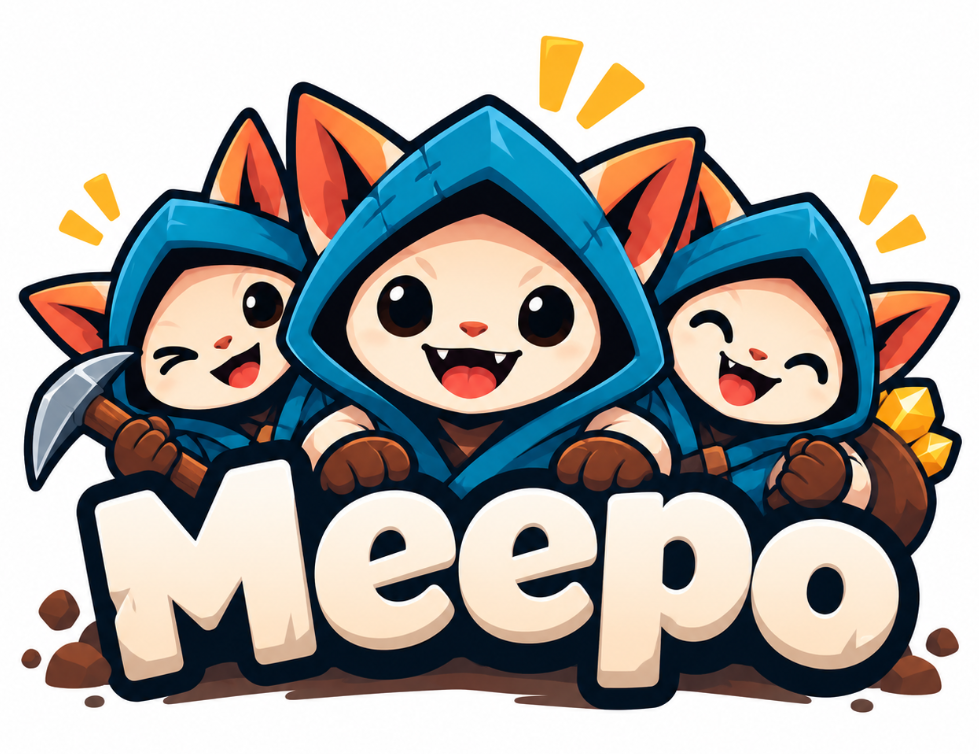
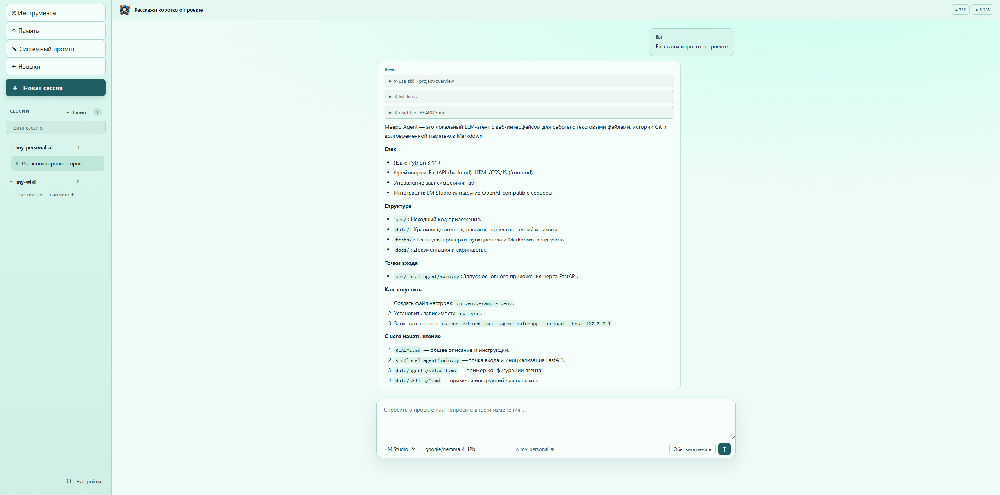

# Meepo Agent

<table>
  <tr>
    <td width="48%"></td>
    <td width="52%" valign="top">
      <h2 style="margin-top: 0;">Возможности</h2>
      <ul>
        <li>Общение с локальной моделью через LM Studio или другой OpenAI-compatible сервер, ответ печатается по мере генерации.</li>
        <li>Сессии и история разговоров в читаемых JSON/JSONL-файлах.</li>
        <li>Поиск, чтение и запись файлов выбранной рабочей папки с подтверждением записи.</li>
        <li>Долговременная память в Markdown и резюме длинных разговоров.</li>
        <li>Светлая и тёмная темы, оформление ответов в Markdown.</li>
      </ul>
    </td>
  </tr>
</table>



Локальный LLM-агент с веб-интерфейсом. Работает с моделью, запущенной в LM Studio (или на другом OpenAI-compatible сервере), хранит разговоры в локальных файлах и при явном включении работает с файлами выбранной рабочей папки. Проект находится на раннем этапе разработки (v0.1).

## Что уже работает

- Сессии с сохраняемой историей: создание, поиск, переименование прямо в шапке и удаление с подтверждением.
- Проекты: рабочая папка с общими настройками. Папка выбирается в диалоге, инструменты включаются один раз для всех сессий проекта, агент и модель запоминаются по последнему выбору. Сессии без проекта — обычные чаты без доступа к файлам.
- Ответ модели приходит потоком: текст появляется по мере генерации, пока модель думает — идёт таймер, кнопка «■» останавливает ответ (уже написанное сохраняется).
- Инструменты папки проекта: список файлов, чтение, поиск по тексту, запись и точечная правка файла, а также чтение истории git (список коммитов и содержимое коммита). Каждую запись и правку нужно подтвердить в чате. Инструменты выключены по умолчанию и включаются для проекта.
- Навыки: готовые инструкции для типовых задач (разбор проекта, ревью коммита, история изменений, объяснение кода). Модель видит список навыков и сама подгружает нужный.
- Лог хода: пока модель думает, по клику на статус видно, как собран контекст, какие инструменты вызваны и что модель рассуждает.
- Вызовы инструментов и их результаты сохраняются в истории: в чате они показаны свёрнутыми блоками, а модель помнит прочитанное на следующих ходах.
- Контекст подбирается по размеру окна модели: LM Studio сообщает его сама, для других серверов используется `DEFAULT_CONTEXT_TOKENS`. Сообщения, не вошедшие в окно, сворачиваются в краткое резюме сессии.
- Долговременная память в Markdown: обновляется по кнопке или автоматически каждые `MEMORY_AUTO_UPDATE_MESSAGES` реплик пользователя.
- Агенты описываются Markdown-файлами в `data/agents/`, провайдеры — в `.env`.
- Светлая и тёмная темы. Ответы агента отображают основные элементы Markdown, включая таблицы и блоки кода с кнопкой копирования.

Приложение написано на Python/FastAPI с обычным HTML, CSS и JavaScript без сборки.

## Быстрый старт

Нужны Python 3.11 или новее, `uv`, установленный LM Studio и загруженная в нём модель. В LM Studio включите локальный API-сервер; адрес по умолчанию указан в `.env.example`.

1. Создайте локальный файл настроек:

   ```powershell
   Copy-Item .env.example .env
   ```

   В macOS/Linux используйте `cp .env.example .env`. Если адрес LM Studio отличается, измените `LM_STUDIO_BASE_URL` в `.env`. Значение `DEFAULT_MODEL` можно заменить на ID своей модели или оставить модель выбранной в интерфейсе.

2. Установите зависимости и запустите приложение:

   ```powershell
   uv sync
   uv run uvicorn local_agent.main:app --reload --host 127.0.0.1
   ```

3. Откройте [приложение](http://127.0.0.1:8000/) в браузере, создайте сессию и выберите модель под полем сообщения. Описание HTTP API доступно по адресу [127.0.0.1:8000/docs](http://127.0.0.1:8000/docs).

Приложение можно открыть без LM Studio, но для ответов модели его локальный API-сервер должен работать. Значение модели в `.env.example` — только пример: оно должно совпадать с моделью, доступной в вашем LM Studio.

## Работа с интерфейсом

- Нажмите Enter, чтобы отправить сообщение; Ctrl+Enter добавляет новую строку. Пока модель отвечает, кнопка отправки превращается в «■» и останавливает ответ.
- Нажмите на название сессии в шапке, чтобы переименовать её. Клик вне поля или Enter сохраняет новое название, Escape отменяет правку. Поле над списком сессий ищет по названию.
- Агент (если их несколько), провайдер, модель и рабочая папка находятся под полем ввода. Изменения сохраняются автоматически и дополнительно проверяются перед отправкой сообщения.
- Для работы с файлами создайте проект кнопкой «＋ Проект» над списком сессий и выберите папку в диалоге (путь можно и вставить). Затем включите нужные пункты в разделе «Инструменты» — они действуют во всех сессиях проекта. Модель должна поддерживать вызов инструментов.
- В сайдбаре проекты показаны группами: «＋» в строке проекта создаёт в нём сессию, «✎» открывает настройки (название, папка, удаление). Удаление проекта не трогает файлы на диске, а его сессии переходят в «Без проекта» без доступа к файлам.
- Кнопка с папкой под полем ввода показывает проект сессии и открывает его настройки. В сессии без проекта она предлагает выбрать папку — сессия перейдёт в проект этой папки.
- Когда модель хочет записать или изменить файл, в чате появляется карточка с путём и содержимым (для правки — что было и что станет): «Разрешить» или «Отклонить». Без ответа за 5 минут запись отклоняется.
- В разделах «Системный промпт» и «Навыки» можно редактировать текст агента и инструкции навыков; изменения действуют со следующего сообщения.
- В разделе «Память» Markdown-файлы можно просматривать и редактировать вручную. Кнопка «Обновить память» обрабатывает только новые сообщения выбранной сессии.
- Тема выбирается в Settings и запоминается в браузере.

Первый счётчик в шапке показывает входные токены **последнего запроса** (если сервер их сообщил), а не длину последнего ответа. Второй — **приблизительную оценку** токенов во всех сохранённых сообщениях сессии. В запрос попадают системная инструкция, память, резюме и столько последних сообщений, сколько помещается в окно модели (но не больше `MAX_CONTEXT_MESSAGES` реплик); `RESPONSE_RESERVE_TOKENS` оставляется под ответ.

## Настройки и данные

Все переменные перечислены в [.env.example](.env.example): адреса провайдеров, модель по умолчанию, пути к данным, лимиты контекста, автообновление памяти, таймаут запроса и разрешённые хосты. `MEMORY_MODEL` необязательна: если она не задана, память обновляется моделью текущей сессии. Локальный `.env` и папка `data/` исключены из Git.

| Путь | Что хранит |
| --- | --- |
| `data/agents/<id>.md` | Агенты: параметры и системный промпт |
| `data/skills/<id>.md` | Навыки: название, описание и инструкции |
| `data/projects/<project_id>.json` | Проекты: папка, включённые инструменты, агент и модель |
| `data/sessions/<session_id>.json` | Метаданные сессии, её проект и резюме |
| `data/conversations/<session_id>.jsonl` | Полная история, включая вызовы инструментов |
| `data/memory/*.md` | Долговременная память |

**Агенты.** При первом запуске создаётся `data/agents/default.md`. Каждый файл — отдельный агент, его ID совпадает с именем файла:

```markdown
---
name: Default Agent
provider: lm_studio
model:
tools: list_files, read_file, search_files, write_file, edit_file, git_log, git_show
---
Ты полезный локальный ассистент. Отвечай на языке пользователя.
```

Пустое `model` означает `DEFAULT_MODEL`. `tools` ограничивает, какие инструменты агент вообще может получить; в сессии их всё равно нужно включить. Системный промпт можно менять в интерфейсе без перезапуска, остальные параметры агента применяются после перезапуска.

**Навыки.** При первом запуске в `data/skills/` копируются стартовые навыки (только если папки ещё нет — удалённые навыки не возвращаются). Каждый файл — навык с ID по имени файла:

```markdown
---
name: Ревью коммита
description: провести код-ревью одного коммита — найти ошибки, риски и места для упрощения
---
Пошаговые инструкции для модели…
```

В системный промпт попадает только список `id: description`; полный текст модель получает инструментом `use_skill`, когда задача подходит. Этот инструмент доступен всегда, когда есть навыки, — ему не нужны рабочая папка и включение в сессии. Новые навыки подхватываются после перезапуска.

**Провайдеры.** LM Studio настраивается через `LM_STUDIO_BASE_URL`. Дополнительные OpenAI-compatible серверы задаются JSON-списком:

```dotenv
LLM_PROVIDERS=[{"id":"ollama","name":"Ollama","base_url":"http://127.0.0.1:11434/v1"}]
```

Для облачного API добавьте `"api_key": "..."`.

Удаление сессии удаляет её JSON-метаданные, JSONL-архив и отметку обработки памяти; записи в памяти остаются. Если история важна, сделайте резервную копию папки `data/` перед удалением или экспериментами с обновлениями.

## Безопасность и ограничения

- У приложения пока нет учётных записей и аутентификации. Запускайте его на `127.0.0.1`; **не открывайте сервер в интернет** без дополнительной защиты.
- Файловые инструменты принимают только относительные пути внутри рабочей папки. Чтение ограничено текстовыми UTF-8-файлами до 64 КБ, запись — 256 КБ и требует подтверждения. Выполнение команд не реализовано.
- Git-инструменты только читают историю: фиксированные команды `git log` и `git show`, коммит — только по хешу, пути — только внутри рабочей папки. Внешние программы из конфигурации репозитория (external diff, textconv, pager) отключены.
- Сервер принимает запросы только с хостов из `ALLOWED_HOSTS` (по умолчанию `127.0.0.1,localhost`) и отклоняет изменяющие запросы со сторонних страниц. Это защищает от DNS rebinding и CSRF из браузера. Если открываете приложение по другому адресу, добавьте его в `ALLOWED_HOSTS`.
- Не выбирайте рабочую папку с секретами, которые не хотите передавать модели.
- Диалог выбора папки получает с сервера только имена папок — не файлы и не их содержимое; скрытые папки (`.git`, `$Recycle.Bin`) не показываются.
- Markdown-рендерер поддерживает распространённую разметку, но пока не всю спецификацию Markdown. Произвольный HTML из ответов не выполняется.

## Разработка и проверки

```powershell
uv sync --extra dev
uv run pytest -q
uv run ruff check src tests
```

Для отдельной проверки Markdown нужен Node.js: `node tests/test_markdown.mjs`. Проверка с живой моделью обычно пропускается; её можно запустить, задав `LM_STUDIO_TEST_MODEL` и включив локальный сервер LM Studio.
